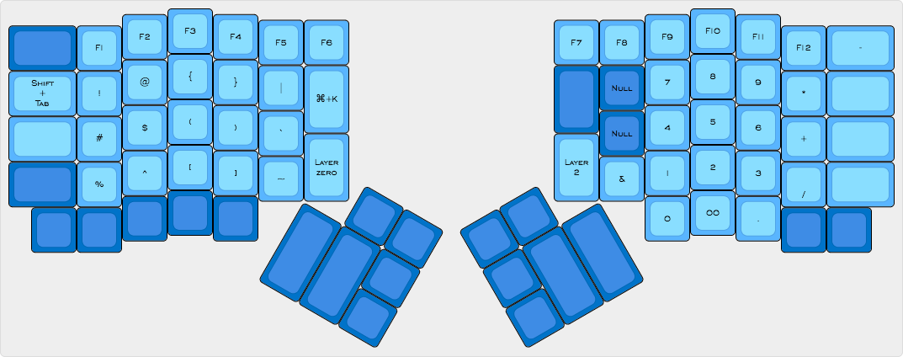
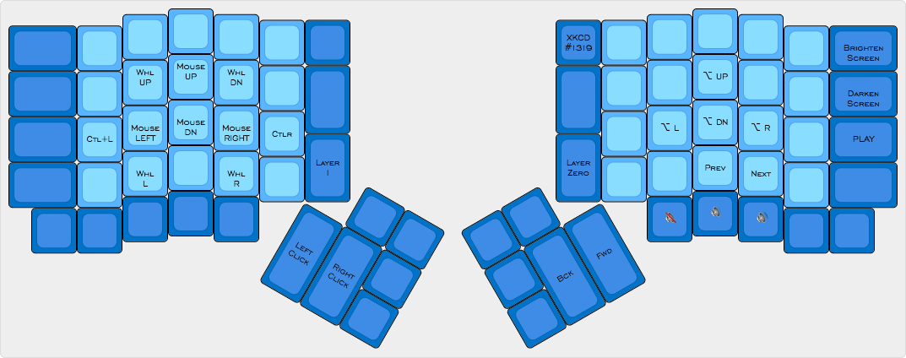
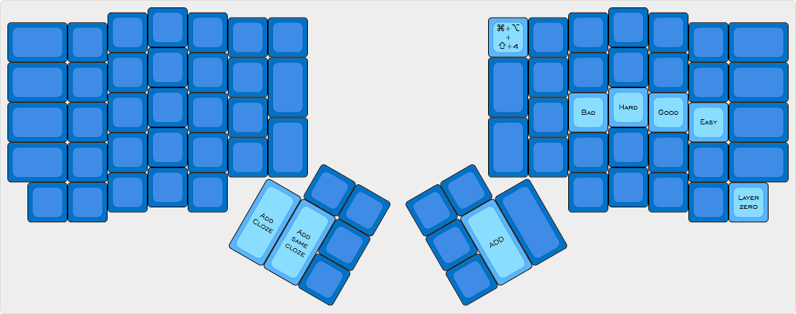

# MeagerDox
I decided to build an ErgoDox as I wanted to use my thumbs for more with the added ergonimc benefits of a split board and ortholinear layout. I knew my hands were hurting from the weird contortions of copying and pasting constantly on my Mac, but I had no idea how strained I really was until I started moving as many modifier keys to the thumb clusters.

The overall goal of this layout is to place many modifiers into the thumb clusters and often used keys to the home row, while retaining the `QWERTY` layout for Mac.

##Credit where credit is due
The intial layout used was from the [ErgoDox EZ Configurator](https://ergodox-ez.com/pages/graphical-configurator). I went through 26+ iterations within the configurator prior to beginning my journey with QMK itself. Much of the dual function/layer keys are influenced by and adapted from the EZ Configurator.

Many features in this layout are either directly inspired by or adaptations of [Algernon's incredible ErgoDox layout](https://github.com/algernon/ergodox-layout). Specifically: TapDance and its usage, and the brillant idea of using TapDance to combining the four keys for parens, brackets, and curly braces into 2 keys.

##Layer 0: Base

###Macro Keys
* `Slack` key sends keys for spotlight search to pull up Slack.
* `Zendesk` triggers spotlight and then calls Typinator expansion to open my Zendesk Agent dashboard in Chrome.

### Tap/Hold Macro Keys
* `Paste/Paste Special` key sends Paste on tap and Paste Special when held.
* `Screen/Video` key sends `||scrn` whent tapped and '||video when held'
  - [Typinator](http://www.ergonis.com/products/typinator/) expands `||scrn` into `(Screenshot: <CLIPBOARD CONTENTS>)`, and `||video` into `(Video: <CLIPBOARD CONTENTS>)`, the QMK macro then moves back to before the last paren, inserts a space and removes a space to create a hyperlink for use in Zendesk.
* When tapped, `Todoist` toggles quick add window for a new Todoist task (`CMD + Shift + A`) and switches to Todoist when held

###TapDance Keys
* `Copy/Cut` key copies on tap, cut's on two taps.
* One tap on `Snagit` key = sends `Ctrl + Shift + C` which is Snagit's selector and two taps on `Snagit` key = `Cmd + Shift + Opt + 4`, OS X cropping screenshot that is copied to the clipboard only.
* Tapping the `([{`/`}])` keys once yields `(`, tapping them twice yields `[` (or `{` when shifted).

##Layer 1: Symbols

##Layer 2: Mouse & Media Keys

* `XKCD #1319`Key that ironically paritally-automates sending the link to [XKCD #1319](https://xkcd.com/1319/).

##Layer 3: Anki

This layer is specifically for use with the notecard program [Anki](ankiweb.net/about).

##Layer 4: Arrow/Movements

