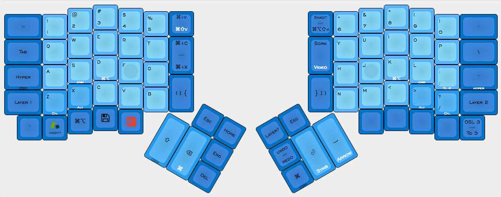

# MeagerDox
==========================================
meagerfindings' ErgoDox layout for Mac.

##Synopsis:
This layout is geared toward moving as many modifier keys to the thumb clusters and often used keys to the home row, while retaining the `QWERTY` layout.

##Credit where credit is due
The intial layout used was from the ErgoDox EZ Configurator. I went through 26+ iterations within the configurator prior to beginning my journey with QMK itself. Much of the dual function/layer keys are influenced by and adapted from the EZ Configurator.

Many features in this layout are either directly inspired by or adaptations of [Algernon's incredible ErgoDox layout](https://github.com/algernon/ergodox-layout). Specifically: TapDance and its usage, and the brillant idea of using TapDance to combining the four keys for parens, brackets, and curly braces into 2 keys.

Diagonal MouseKeys and MouseKeys Macros were adapted from [Michael Kreene's "The Ordinary ErgoDox" Layout](https://github.com/qmk/qmk_firmware/blob/master/keyboards/ergodox/keymaps/ordinary/keymap.c).

##Layer 0: Base

* Tapping the `([{`/`}])` keys once yields `(`, tapping them twice yields `[` (or `{` when shifted).

##Layer 1: Symbols

##Layer 3: Anki

##Layer 4: Arrow/Movements
